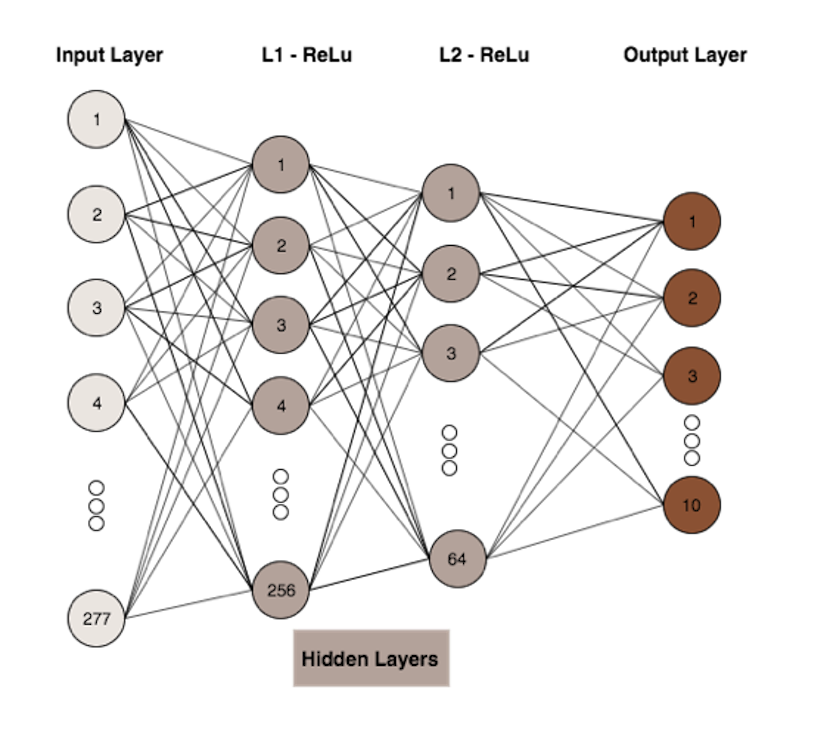
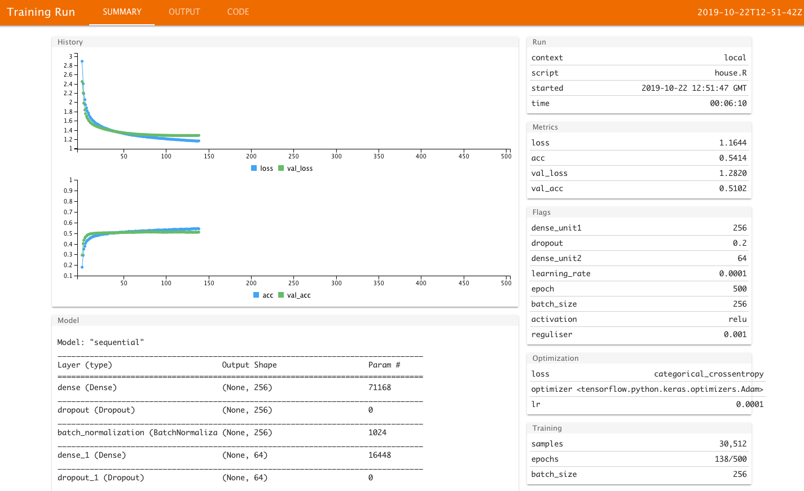

## Introduction

This project looks at the feasibility of applying machine learning tools to the pricing of houses. We review and apply machine learning concepts through the lens of a dataset consisting of all privately sold houses in Melbourne between March 2016 and December 2018 with information on hedonic and structural characteristics. Our goal is to predict the sale price of a house, and performance will be benchmarked against an alternative, more simplistic, approach.

```{r set-options, include=FALSE}
library(tidyverse)
knitr::opts_chunk$set(warning = FALSE, message = FALSE, 
  comment = NA, dpi = 300, echo = FALSE,
  fig.align = "center", out.width = "80%", cache = FALSE, fig.pos= "h")

library(tidyverse)
library(knitr)
library(tfruns)
```


## Section 1: Model  
Model selection was born from discussion of our objectives, and consideration of our dataset.

<!-- Learning problem -->
<!-- Models considered -->
<!-- What are the parameters / hyperparameters -->
<!-- How to optimize them -->
<!-- how they control the complexity/flexibility of the algorithm -->
<!-- does the method scale with large data sets, etc -->


For the problem of predicting house prices for private sales, a theoretical unknown target function exists, but we don't believe any practical target function exists. The simple rationale is that private sales are too heavily dependent on subjective characteristics of how the buyer buys, and how the seller sells, to be accurately approximated in any qualitative or quantitative sense. With this said, our unknown target distribution is therefore the best approximation to such an issue. In considering the modelling approach to take, we reflected on the real world application of such a tool. Presently, when houses are put up for sale they list with an expected range. Similarly, when houses are bid upon, they are done so with nominal amounts of money, such as $10,000 increments. Given such use cases it seems misguided to attempt to price a house at an exact dollar figure, and more sensible to attempt to classify house prices into ranges of prices. After narrowing down our approach, we consider a neural net for the purpose of this project, and an appropriate benchmark model reflecting our need.  


For the benchmark we considered the following models  

- OLS Regression with range classification in post-estimation
- Decision Tree / Random forests
- Naive Bayes
- Multi-class logistic regression

OLS regression was ruled out for it's distributional assumptions which did not fit our dataset, and the desire to choose a model with inherent classification abilities. Naive Bayes was considered for it's ease of implementation and understanding, but ruled out for preference of a more complex model. The choice ultimately came down to random forests and multi-class, or multi-nomial logistic regression. The latter was chosen for it's relatively simple implementation, computational speed, and well documented success in multi-class classification. 

For our neural network, the classification approach simplified things as we were familiar with its implementation from the lecture and tutorial material. The structure and considerations will now be introduced.  

Kauko (2003) has provided an overview on current neural network application on predicting house price and introduced some advanced methods like self-organising map(SOM) and learning vector quantization (LVQ). However, there is no pre-trained architecture for house price forecasting and thus, we build our own two layer deep neural network from scratch. Due to the size of the data (48k observations with 277 features), the architecture is a deep neural network with two hidden layer. A graphic illustration of the architecture is shown in Figure \ref{fig:architecture}. A three hidden layer architecture is also considered but due to the extra computational burden associated with training and hyperparameter training, it is not implemented in this project. 

```{r architecture, fig.cap="Neural network architecture."}

```


Two activation functions, Relu and Tanh are chosen to tune for the middle layers. Relu has its advantage of outputting zeros for negative input, which would be helpful to avoid overfitting. Also, Relu function will increase to infinity at asymptotic and this property allows the relevant weight to be fully updated when the input gets larger. Tanh is also considered because it is  an symmetric activation function that will provide symmetric result for positive and negative inputs (thus don't need normalisation) but unlike relu function, it saturates at asymptotic, which may cause large inputs not being able to get updated. The activation function for the final layer is softmax as this is the appropriate function for multi-level classification as it bounds probability ranges between 0-1, and the sum of probability for inclusion into each category will sum to 1. 

To avoid overfitting of the data, dropout and l2 regularisation are used. Dropout rate is used before each dense layer and is a tuning parameter in the grid serach. L2 regularisation is also applied in each layer to avoid overfitting and a learning rate of 1e-3 is used. 


Batch normalisation is also performed before each dense layer. This process is necessary because it will normalise the extreme large values from the previous layer so that the training process can speed up. Batch normalisation is added after the dropout layer since it makes more sense to only normalise the neurals that will be supplied into the next layer. 

The loss function used is the categorical cross entropy, which is the only option for multi-class classification. 


Our hyperparameters were tuned using grid-search, but due to computation issues stemming from the number of iterations the search had to perform we were only able to proceed half way through this tuning procedure. Discussion of the ranges tuned for each hypterparamter will be included in our experimentation section. 


As for the scaling of our model, we believe given a larger data-set the model would have actually performed better. We had a relatively small feature space to run a neural net, and loss and accuracy may have improved given this was expanded. Performance of the multinomial logistic regression would not be expected to have changed, but the computation time would have significantly grown.

## Section 2: Experiment

### Data

Our dataset was compiled by a user named 'Tony Pino' on kaggle. The data concerns Melbourne housing clearance data from March 2016 through to December 2018. It is important to note that the available datasets in this database were 'Melbourne House Prices Less' and 'Melbourne Housing Full', specifying a reduced and full dataset respectively. Our project looked only at the reduced dataset. Therefore an extension which will be touched on in the latter sections of this report will discuss the changes in results had we used the full dataset.  

Our dataset contained information on 63,013 house sales scraped from publicly available results posted every week on Domain.com.au. The dataset includes variables that detail the suburb, address, rooms, type of real estate, price, method of selling, seller-name, date, postcode, region, propertycount, distance from the CBD and council area. Given we are predicting house prices, the dependent continuous variable, y, defines the sale price of the house in AUD. Further details about the data set as well as some preliminary analysis are included in Appendix. Within our data the decision was made to exclude the seller-name on the basis that it was the individual agent's name and thus irrelevant. This decision was made in error and discovered after our model had been run. The seller name is the name of the real-estate agency entrusted with the sale of the house, and thus contains relevant information to the sale price. Inclusion of this variable would have significantly increased our feature space and it is likely our model suffered from it's exclusion. Thus this is a natural extension to our research.

We first convert our regression problem into a classification problem by transforming house price into 10 categories: (0, 100k], (100k, 300k], (300k, 500k] ... (1500k, 1700k], (1700k, $\infty$) and this allows us to perform neural network on a multi-class classification problem, which is much easier than prediction.

We seperate our dataset into a 90:10 training-test split. The training is done on the 90% of the data with 20% as validation set and the best model fit is then performed on the test set to get the accuracy result. 

The data is first scaled and centred before sending into the neural network for training and normalisation is performed before each dense layer. This normalisation is necessary because it helps to speed up the converging process by normalising the extreme large value outputted from the previous layer. 

We proceed by scaling and centering our data, transforming factors using one-hot encoding to increase feature space and allow our algorithm to improve in prediction, and we subset our data into sets of 90% training and 10% test.

<!-- The optimisation used is ADAM. Different optimiser such as Root Mean Square Propagation (RMSPROP) or Random Gradient Descent (RGD) could be used for tuning but theoratically ADAM is believed to have better performance since it incorporates the momentum from RMSPROP to RGD The learning rate for ADAM is treated as a hyperparameter to tune.  -->

### Evaluation metric

The metrics for evaluation is the loss function rather than the accuracy result. This design is chosen as the house prices in our data are not evenly distributed among all the categories. We can see from Figure \ref{fig:price-class}, price class 4 (ranging from (500k, 700k]) has the most number of observation falls into while very few observations belong to category 1 or 2. If accuracy measure is used for evaluating the algorithm, it will be prone to predicting category 4 or 5 to achieve a higher accuracy result while not learn the data well. Therefore loss function, which evaluates the performance of the algorithm based on its score on categorical cross entropy, is a more reliable measure for our use case. 

```{r price-class, fig.height=2, fig.cap="Price class"}
load("data/house_c.rda")
house_c %>% 
  ggplot(aes(x = price_class)) + 
  geom_histogram() +
  scale_x_continuous(breaks = seq(1, 10,1))
```

### Optimization procedure 

We considered three prominent gradient descent algorithms:

1. RMSProp
2. RGD with momentum
3. Adaptive Moment Estimation (Adam)

Adam is choosen as the optimiser for the project as it combines the strengths of RMSProp and momentum (Kingma, D et al). 

In the optimisation procedure, we use `epoch = 500` and impose early stopping with `patience = 20` in our network structure. This design is chosen because it allows the algorithm to continue to update if necessary and a small epoch will force the algorithm to stop before it is fully updated. 

Hyper-parameter tuning is utilised to find the best combination of parameters given the neurual network architecture defined. Due to the limitation of computational power, a small grid search is implemented with the grid value as shown in Table \ref{tab:hyper-para}. Dense unit starts from 256 as the largest because there are only 277 variable in our feature space. In this project, we dont consider the architecture of first expanding the feature space and then reducing it. Zero is included in the dropout rate is because a RELU activation function would output zeros if the input is negative. This feature of RELU function can be viewed as working as dropout rate. Batch size is also included in the tuning parameter. 

```{r}
kable(tibble(Hyperparameter = c("dense_unit1", "dense_unit2", 
                                "dropout", "batch_size", "activation"),
       Value = c("(256, 128)", "(128, 64, 32)", "(0,0.1, 0.2)", "(64, 128, 256, 512)", "(relu, tanh)")),
       caption = "\\label{tab:hyper-para} The grid value of parameter used in hyperparameter tuning")
```

## Section 3: Results and Discussion

The hypterparameter tuning on the grid defined above is implemented through `tfruns` package. This package allows for organising the training parameters and evaluation results into a dataframe format and create a shiny app to view each training process. Figure \ref{fig:best} provides a screenshot of the best result from the training. The parameter assocaited with the best validation result is presented in Table \ref{tab:best-para}

```{r best, fig.cap="Screenshot of the training with the lowest validation loss.", fig.height=1}

```

```{r best-para}
kable(tibble(Hyperparameter = c("dense_unit1", "dense_unit2", "dropout", "batch_size", "activation"),
       Value = c(256, 64, 0.2, 256, "relu")),caption = "\\label{tab:best-para} Best parameters")
```

This model is then performed on the test set and the prediction matrix is presented in Table 3. The accuracy of neural network algorithm is 50%. The multinomial logistic model is also performedon the test set and the accuracy is 51%. Associated prediction matrix is presented in Table 4. 
```{r}
load("data/pred_nn")
load("data/pred_mnl")
```

```{r pred-matrix-nn}
knitr::kable(pred_nn,caption ="Neural netowrk prediction matrix")
```
```{r pred-matrix-mnl}
knitr::kable(pred_mnl,caption="Multinomial logistic prediction matrix")
```

The neural network is not competitive as the multinomial logistic model from our result. Two reasons could explain this. Firstly. the faeture space (277 variables) of the current dataset is relatively small. This could cause we are not able to build more sophisticated neural network for it to work it magic. Also later we realise the `seller` variable is the name of the selling agency rather than the name of the individual seller. One may expect the selling price of a house could related to the selling agency and this variable could also be added into the neural network. Also there is a larger house price dataset in kaggle and it provides additional information related to the house. 

The second reason is due to the limitation of computation power. There are still some parameters we are keeping constant through the hyperparameter tuning, for example, learning rate. There are also more activation function such as LeakyRELU that we could try to see if better performance can be achieved. 

## Section 4: Conclusion

A random guess in our classification would have been 10%. Our neural network performed with a 50.51% accuracy in classifying house prices into the 10 categories of ranges. The mulitnomial logistic regression performed with a 51.27% accuracy.  
Our network accuracy may have increased if we had the time to allow for a full set of hyperparameter tuning, yet we were also limited by the small feature space in our data. The latter could have been overcome by utilising the variable for seller denoting the agency, and also by utilising the full dataset rather than the reduced as mentioned in our experiment section.  
A key takeaway from this project is that neural networks are most useful in datasets with significant feature space, for their ability to transform and make use of the optimum combination of features.  

## References

Sebastian Ruder (2016). An overview of gradient descent optimisation algorithms. arXiv preprint arXiv:1609.04747.

Kingma, D. P., & Ba, J. L. (2015). Adam: a Method for Stochastic Optimization. International Conference on Learning Representations, 1–13.

Heusel, M., Ramsauer, H., Unterthiner, T., Nessler, B., & Hochreiter, S. (2017). GANs Trained by a Two Time-Scale Update Rule Converge to a Local Nash Equilibrium. In Advances in Neural Information Processing Systems 30 (NIPS 2017).

Kauko, T. (2003). On current neural network applications involving spatial modelling of property prices. Journal of housing and the built environment, 18(2), 159-181.
